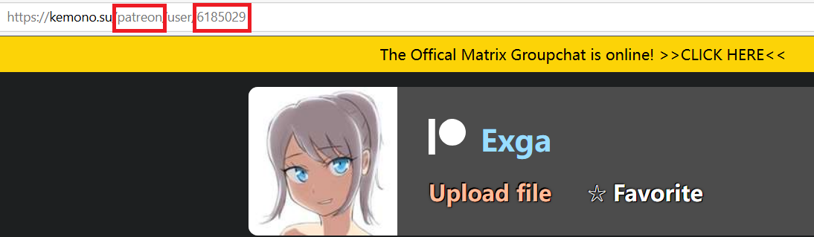
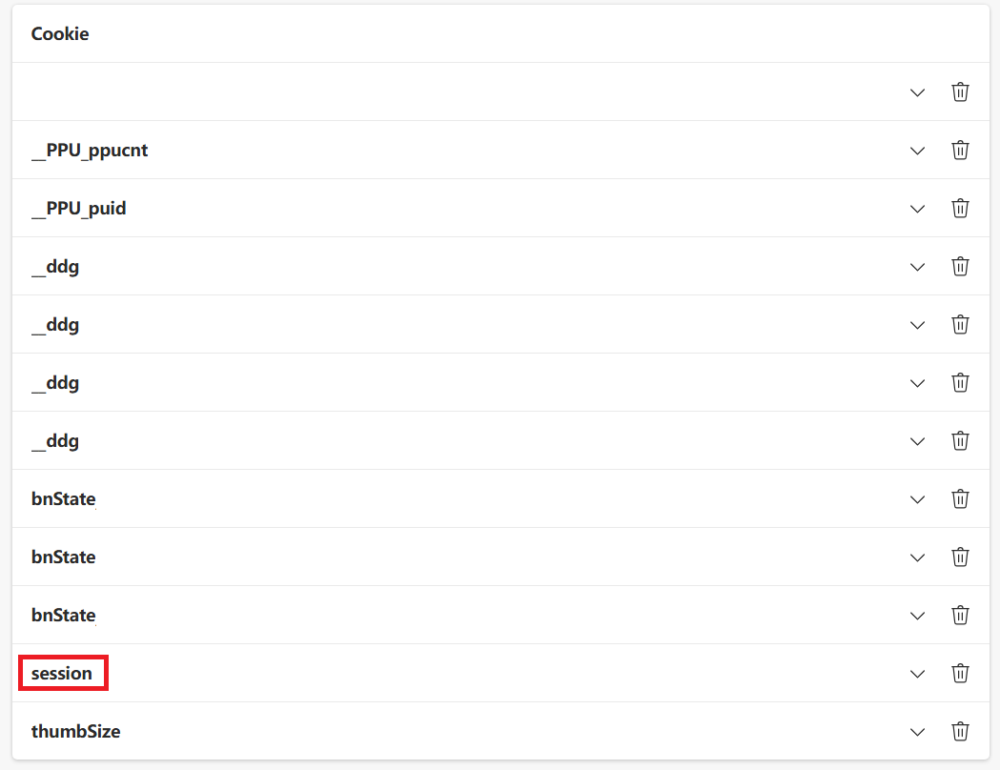

# Kemono Handler
A simple, asynchronous post attachments downloader for kemono.su

## Installation & How to use
0. Check if your python3 version is higher than 3.5.3. If not, install the latest version.
```shell
python --version
```
> Python interpreters that earlier than 3.5.3 do not support **aiohttp**
1. Clone this repo
```shell
git clone https://github.com/RDR2Blackwater/KemonoHandler
```
2. Install required packages
```shell
pip install -r requirements.txt
```
3. Run this script with necessary arguments and optional arguments
* For example, if you want to download the posts before ***2022/12/20*** in ***fantia*** which ***the id of creator is 114514***, and do not want to download the ***PSD*** or the ***in-progress*** files, the command should be:
```shell
python main.py --service "fantia" --creator-id "114514" --cookies "Input your cookie value" --publish-date-before "2022-12-20" --exclude-words "PSD,進捗"
```
4. Buy yourself a coffee and wait for the script done!

## Command Line Arguments

### Required arguments

### `--cookies`
- Cookie value recorded in "session", download might be blocked by DDoS defender without cookies

### `--service`
- Target service name

### `--creator-id`
- Target creator id

## Optional arguments

### `--max-async-download`
- Max allowed asynchronous download threads (default: 3)

### `--api-server`
- Target api server to request (default: kemono)

### `--publish-date-before`
- Filter the posts before the specified date, format of the date should be YYYY-MM-DD

### `--publish-date-after`
- Filter the posts after the specified date, format of the date should be YYYY-MM-DD

### `--exclude-words`
- Exclude posts that contains given words in title, split words by ","

### `--timeout`
- Max allowed download time in seconds (default: 3600)

## FaQ
* How could I know the id/service of creator?

Check the URL of the creator main page:

Where the URL of the creator's homepage is composed as **kemono.su/{service}/user/{creator-id}**

* What is the Cookie value? Where could I get it?

Cookie value is a session key that can be found in cookies after a successful login. 

In Edge, you can get cookies by accessing <edge://settings/cookies/detail?site=kemono.su> to get the cookies and look for **session** content.


* If the option "--exclude-words" supports Regex Expressions?

No.

* Where are the downloaded attachments saved?

All attachments are saved in the folder with the name of creators like `Exga`, which is in the same root path of the script.

> Attachments are renamed before download using the format **{post date}\_{post title}\_{index}.{attachment_prefix}**. However, to avoid unpredictable path errors, invalid characters in the post title will be removed.
